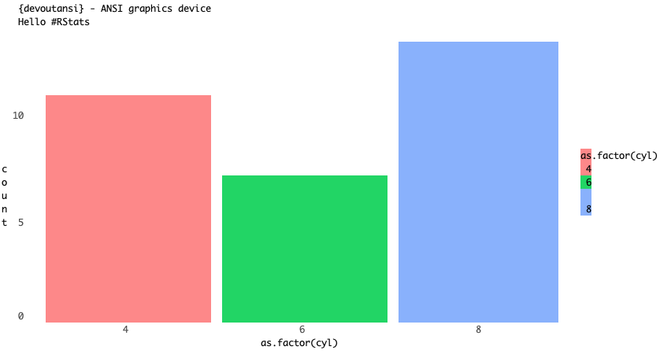
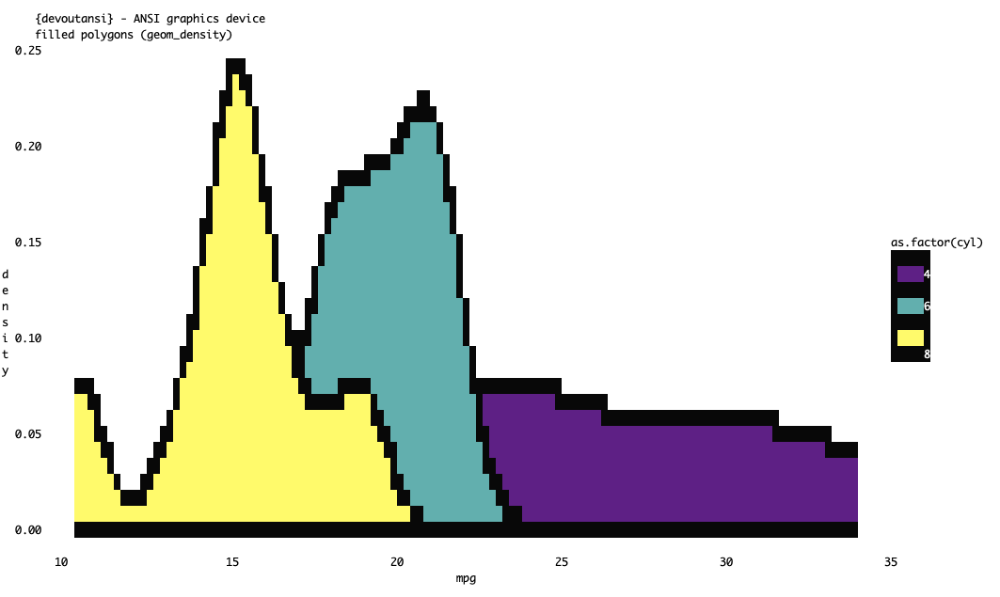
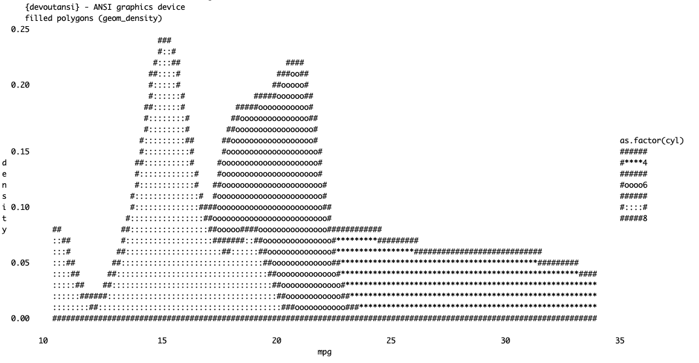
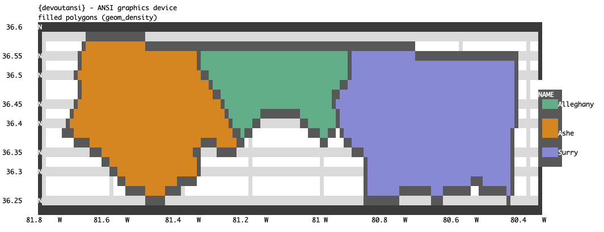
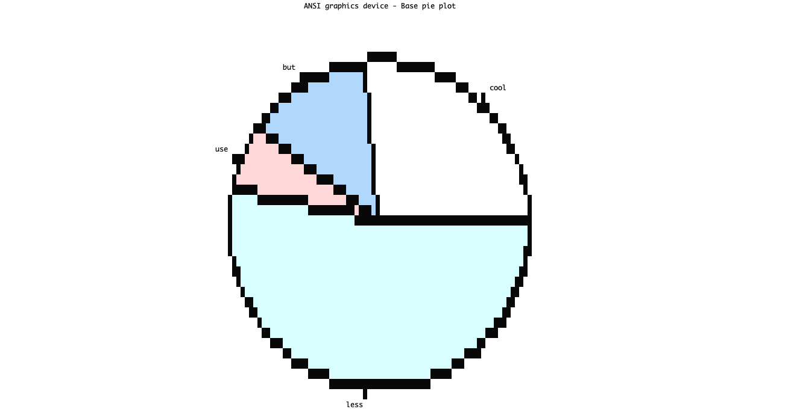
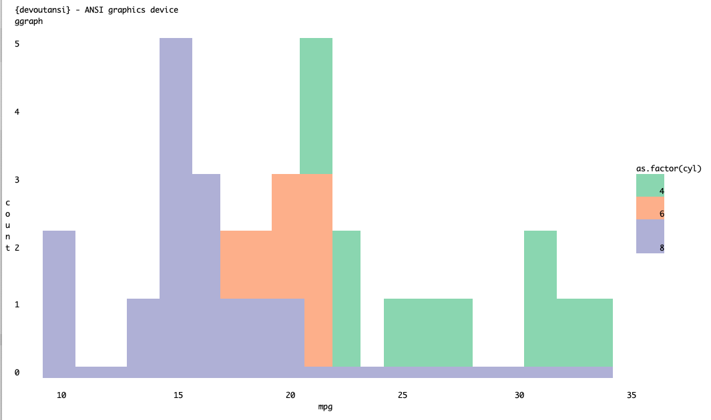
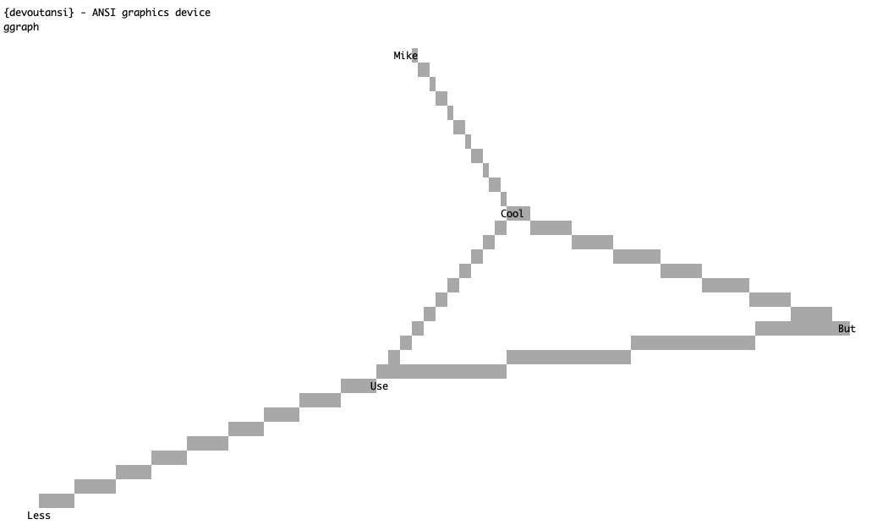

<!-- README.md is generated from README.Rmd. Please edit that file -->

# devoutansi 

<!-- badges: start -->


 <!-- badges: end -->

`devoutansi` is a graphics output device for R which will output
graphics as text files with ANSI colouring.

## Installation

You can install from
[GitHub](https://github.com/coolbutuseless/devoutansi) with:

``` r
# install.packages("remotes")
remotes::install_github("coolbutuseless/devout")     # devout framework
remotes::install_github("coolbutuseless/miniansi")   # ANSI doc creator
remotes::install_github("coolbutuseless/devoutansi") # this device
```

#### Limitations

  - No current support for clipping paths or rasters.
  - Text positioning and spacing will always be a little off
  - Rotated text (except for 0 and 90 degrees) is probably going to be
    placed incorrectly.
  - No support for transparency i.e. alpha has no effect other then to
    suppress rendering completely when `alpha = 0`

# Basic Usage

Use `devoutansi::ansi()` as you would the `pdf()` or `png()` device.

The output will be written as ANSI characters to the screen, or a text
file if specified.

**Note:** - Because you can’t readily view ANSI in an HTML document, all
images included are screenshots of the output in my terminal.

**Note:** Click any image to view its ANSI text

``` r
library(ggplot2)
library(devoutansi)

#~~~~~~~~~~~~~~~~~~~~~~~~~~~~~~~~~~~~~~~~~~~~~~~~~~~~~~~~~~~~~~~~~~~~~~~~~~~~~
# PNG output of plot
#~~~~~~~~~~~~~~~~~~~~~~~~~~~~~~~~~~~~~~~~~~~~~~~~~~~~~~~~~~~~~~~~~~~~~~~~~~~~~
p <- ggplot(mtcars) +
  geom_bar(aes(as.factor(cyl), fill = as.factor(cyl)), colour = NA) +
  theme_minimal() + 
  theme(
    panel.grid   = element_blank()
  ) +
  labs(
    title    = "{devoutansi} - ANSI graphics device",
    subtitle = "Hello #RStats"
  ) 

#~~~~~~~~~~~~~~~~~~~~~~~~~~~~~~~~~~~~~~~~~~~~~~~~~~~~~~~~~~~~~~~~~~~~~~~~~~~~~
# ANSI output
#~~~~~~~~~~~~~~~~~~~~~~~~~~~~~~~~~~~~~~~~~~~~~~~~~~~~~~~~~~~~~~~~~~~~~~~~~~~~~
devoutansi::ansi(filename = "man/figures/mtcars1.txt", width = 120)
  p 
invisible(dev.off())
```

<a href="man/figures/mtcars1.txt"></a>

All the demo plots on this page are available as their ANSI txt files by
clicking on the images.

## `geom_density()`

<a href="man/figures/mtcars3.txt"></a>

<details>

<summary> Click to show/hide code </summary>

``` r
library(ggplot2)

p <- ggplot(mtcars) +
  geom_density(aes(mpg, fill = as.factor(cyl))) + 
  theme_minimal() +
  theme(
    panel.grid      = element_blank(), 
    legend.key.size = unit(5, 'in')
  ) + 
  scale_fill_viridis_d() + 
  labs(
    title    = "{devoutansi} - ANSI graphics device",
    subtitle = "filled polygons (geom_density)"
  )

#~~~~~~~~~~~~~~~~~~~~~~~~~~~~~~~~~~~~~~~~~~~~~~~~~~~~~~~~~~~~~~~~~~~~~~~~~~~~~
# ANSI output
#~~~~~~~~~~~~~~~~~~~~~~~~~~~~~~~~~~~~~~~~~~~~~~~~~~~~~~~~~~~~~~~~~~~~~~~~~~~~~
devoutansi::ansi("man/figures/mtcars3.txt", width = 150)
p
invisible(dev.off())
```

</details>

## `geom_density()` in ASCII only

<a href="man/figures/mtcars3.txt"></a>

<details>

<summary> Click to show/hide code </summary>

Extra options for ASCII mode:

  - `char_lookup_table` set to 1, 2 or 3 to select the character set
  - `pow` nonlinear intensity remapping using this exponent. default 1

<!-- end list -->

``` r
#~~~~~~~~~~~~~~~~~~~~~~~~~~~~~~~~~~~~~~~~~~~~~~~~~~~~~~~~~~~~~~~~~~~~~~~~~~~~~
# ANSI output
#~~~~~~~~~~~~~~~~~~~~~~~~~~~~~~~~~~~~~~~~~~~~~~~~~~~~~~~~~~~~~~~~~~~~~~~~~~~~~
devoutansi::ansi("man/figures/mtcars3-ascii.txt", width = 150, plain_ascii = TRUE)
p
invisible(dev.off())
```

</details>

## `geom_sf()`

<a href="man/figures/geom-sf.txt"></a>

<details>

<summary> Click to show/hide code </summary>

``` r
library(dplyr)
library(sf)
library(ggplot2)
library(devoutansi)

nc <- sf::st_read(system.file("shape/nc.shp", package = "sf"), quiet = TRUE)
nc <- nc %>% filter(between(CNTY_ID, 1820, 1830))

p <- ggplot(nc) +
  geom_sf(aes(fill = NAME)) +
  theme_bw(15) +
  theme(legend.key.size = unit(5, 'in')) + 
  scale_fill_brewer(palette = 'Dark2') + 
  labs(
    title    = "{devoutansi} - ANSI graphics device",
    subtitle = "filled polygons (geom_density)"
  )

#~~~~~~~~~~~~~~~~~~~~~~~~~~~~~~~~~~~~~~~~~~~~~~~~~~~~~~~~~~~~~~~~~~~~~~~~~~~~~
# ANSI output
#~~~~~~~~~~~~~~~~~~~~~~~~~~~~~~~~~~~~~~~~~~~~~~~~~~~~~~~~~~~~~~~~~~~~~~~~~~~~~
devoutansi::ansi("man/figures/geom-sf.txt", width = 150)
p
invisible(dev.off())
```

</details>

## `pie` plot from base R

<a href="man/figures/pie.txt"></a>

<details>

<summary> Click to show/hide code </summary>

``` r
devoutansi::ansi("man/figures/pie.txt", width = 180)
pie(c(cool = 4, but = 2, use = 1, less = 8), main = "ANSI graphics device - Base pie plot")
invisible(dev.off())
```

</details>

## `geom_histogram()`

<a href="man/figures/mtcars2.txt"></a>

<details>

<summary> Click to show/hide code </summary>

``` r
library(ggplot2)

p <- ggplot(mtcars) +
  geom_histogram(aes(mpg, fill = as.factor(cyl)), bins = 20) + 
  theme_minimal() +
  theme(
    panel.grid      = element_blank(),
    legend.key.size = unit(5, 'in')
  ) + 
  labs(
    title    = "{devoutansi} - ANSI graphics device",
    subtitle = "ggraph"
  ) + 
  scale_fill_brewer(palette = 'Set2')

#~~~~~~~~~~~~~~~~~~~~~~~~~~~~~~~~~~~~~~~~~~~~~~~~~~~~~~~~~~~~~~~~~~~~~~~~~~~~~
# ANSI output
#~~~~~~~~~~~~~~~~~~~~~~~~~~~~~~~~~~~~~~~~~~~~~~~~~~~~~~~~~~~~~~~~~~~~~~~~~~~~~
ansi("man/figures/mtcars2.txt", width = 150)
p
invisible(dev.off())
```

</details>

## `ggraph`

<a href="man/figures/ggraph.txt"></a>

<details>

<summary> Click to show/hide code </summary>

``` r
library(ggplot2)
library(ggraph)
library(tidygraph)
library(dplyr)

set.seed(1)
simple <- create_notable('bull') %>%
  mutate(name = c('But', 'Use', 'Cool', 'Less', 'Mike')) %>%
  activate(edges) %>%
  mutate(type = sample(c('friend', 'foe'), 5, TRUE))

p <- ggraph(simple, layout = 'graphopt') +
  geom_edge_link0(colour = 'grey70') +
  geom_node_text(aes(label = name), size = 10) + 
  theme_void() + 
  labs(
    title    = "{devoutansi} - ANSI graphics device",
    subtitle = "ggraph"
  )

#~~~~~~~~~~~~~~~~~~~~~~~~~~~~~~~~~~~~~~~~~~~~~~~~~~~~~~~~~~~~~~~~~~~~~~~~~~~~~
# ANSI output
#~~~~~~~~~~~~~~~~~~~~~~~~~~~~~~~~~~~~~~~~~~~~~~~~~~~~~~~~~~~~~~~~~~~~~~~~~~~~~
ansi("man/figures/ggraph.txt", width = 150)
p
invisible(dev.off())
```

</details>
